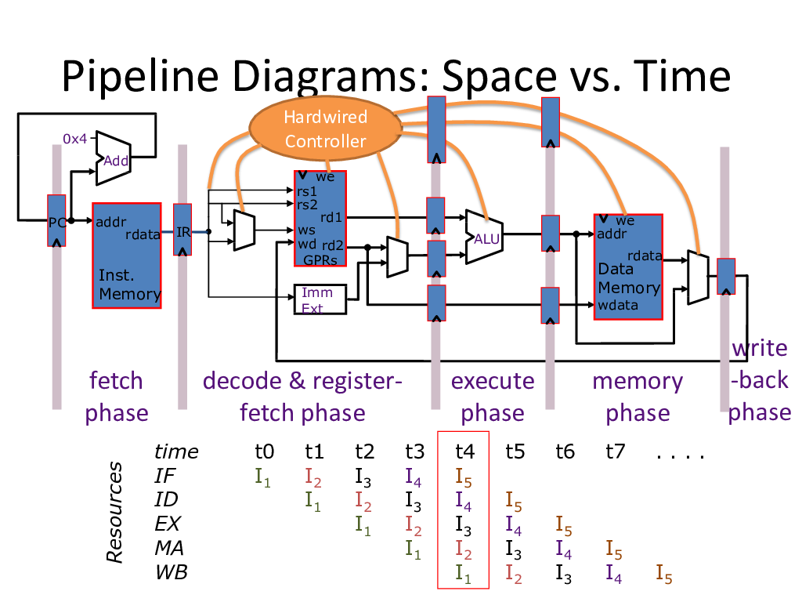

Advanced Computer Architecture
==============================
Exam 1 Study Guide
^^^^^^^^^^^^^^^^^^

.. default-role:: math

.. contents::

The Most Important Equation for Computer Architecture
-----------------------------------------------------

The *CPU Preformance Equation* is the most important equation in computer
architecture.

.. math::

    \text{Latency} = \text{Instruction Count} \times
                     \frac{\text{Cycles}}{\text{Instruction}} \times
                     \frac{\text{Seconds}}{\text{Cycle}}

The corollary from this is that:

.. math::

    \text{Latency} = \frac{\text{Instruction Count} \times
                     \frac{\text{Cycles}}{\text{Instruction}}}
                     {\text{Clock Speed in Hz}}

Cache Misses
------------

There are two kinds of locality:

:Spatial Locality:
    The program is likely to access data close to other data it just accessed.
:Temporal Locality:
    The program is likely to access the data it just accessed again.

There are three kinds of cache misses:

:Compulsory: The program has **never requested this data before**. This kind
             of cache miss is unavoidable, unless we consider prefetching.
:Confiict:   The program has seen this data before, but the **cache was
             already evicted**.
:Capacity:   The program was actively using more data than the cache could
             even contain.

Basic Cache Organization
~~~~~~~~~~~~~~~~~~~~~~~~

A cache has a number of terms associated with it:

:Line:       The *number* used to refer to the entry in the cache.
:Data Block: A set containing a copy of memory for a part of memory.
:Line Size:  The number of items in a data block.
:Tag:        The starting address of a data block.

Equations:

.. math::

    \text{Number of index bits} = \log_2\left(\frac{\text{Number of cache lines}}{\text{Associativity}}\right)

    \text{Number of offset bits} = \log_2\left(\text{Cache line size}\right)

    \text{Number of tag bits} = \text{Address length} - (\text{index bits} + \text{offset bits})

Page Table Entries: how do we optimize?
---------------------------------------

Hierarchical Page Tables
~~~~~~~~~~~~~~~~~~~~~~~~

* Break the virtual page number into several pieces
* If each piece has `N` bits, build an `2^N`-ary tree
* Only store the part of the tree that contain valid pages
* To do translation, walk down the tree using the pieces to select with child
  to visit.

Making Translation Fast: Translation Lookaside Buffer
~~~~~~~~~~~~~~~~~~~~~~~~~~~~~~~~~~~~~~~~~~~~~~~~~~~~~

* Build a cache for page table mappings
* Typically fully associative

Virtual Caches
~~~~~~~~~~~~~~

**Idea:** if we use virtual addresses in our cache, we only need to reference
the TLB_ after a cache miss.

.. _TLB: `Making Translation Fast: Translation Lookaside Buffer`_

Downside: need to flush cache on context switch.

Designing an efficient pipeline
-------------------------------

Amdahl's Law
------------

.. note::

    Bo Wu seems to *really* like Amdahl's Law. So learn this stuff well, and do
    plenty of examples!

If we can speed up an `x` portion of the program by `S` times, the
total speedup (`S_{\text{tot}}`) is:

.. math::

    S_{\text{tot}} = \frac{1}{\frac{x}{S} + (1 - x)}

Corollary 1
~~~~~~~~~~~

Maximum speedup (`S = \infty`) when we target `x` portion of the program is:

.. math::

    S_{\max} = \frac{1}{1 - x}

Corollary 2
~~~~~~~~~~~

Make the *common case* fast!

.. note::

    In this case, common case means *most time consuming*, not *most frequent*.

Corollary 3
~~~~~~~~~~~

The speedup of parallelizing across `p` processors when `x` portion of the
program is `p`-way parallelizable is:

.. math::

    S_{\text{par}} = \frac{1}{\frac{x}{p} + (1 - x)}

Corollary 4
~~~~~~~~~~~

Amdahl's law for latency:

.. math::

    \text{latency}_{\text{new}} =
    x \times \frac{\text{latency}_{\text{old}}}{S} +
    (1 - x) \times \text{latency}_{\text{old}}

Data Dependence
---------------

Bypassing
---------

What kind of hazard does it solve?

Other Stuff
-----------

* Fully understand **virtual memory**

